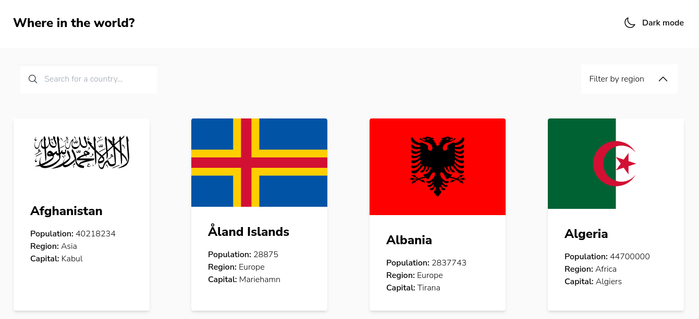

# Frontend Mentor - REST Countries API with color theme switcher solution

This is a solution to the [REST Countries API with color theme switcher challenge on Frontend Mentor](https://www.frontendmentor.io/challenges/rest-countries-api-with-color-theme-switcher-5cacc469fec04111f7b848ca). Frontend Mentor challenges help you improve your coding skills by building realistic projects.

## Table of contents

- [Overview](#overview)
  - [The challenge](#the-challenge)
  - [Screenshot](#screenshot)
  - [Links](#links)
- [My process](#my-process)
  - [Built with](#built-with)
  - [Continued development](#continued-development)
- [Author](#author)
- [Acknowledgments](#acknowledgments)

## Overview

### The challenge

Users should be able to:

- See all countries from the API on the homepage
- Search for a country using an `input` field
- Filter countries by region
- Click on a country to see more detailed information on a separate page
- Click through to the border countries on the detail page
- Toggle the color scheme between light and dark mode *(optional)*

### Screenshot

### Links

- Solution URL: [Github solution URL here](https://github.com/gamcode98/rest-countries-api)
- Live Site URL: [Netlify live site URL here](https://rest-countries-api-gamcode.netlify.app/)

## My process

### Built with

- Mobile-first workflow
- [Tailwindcss](https://tailwindcss.com/) - CSS framework
- [React](https://reactjs.org/) - JS library
- [Vite](https://vitejs.dev/) - Generator frontend tool

### Continued development

I'm going to continue development Frontend Mentor projects.

## Author

- Website - [Gabriel Alejandro Mamani](https://portfolio-gamcode.netlify.app/)
- Frontend Mentor - [@gamcode98](https://www.frontendmentor.io/profile/gamcode98)

## Acknowledgments

Thank you Frontend Mentor for these projects to improve skills.
